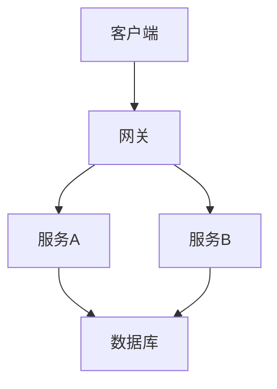
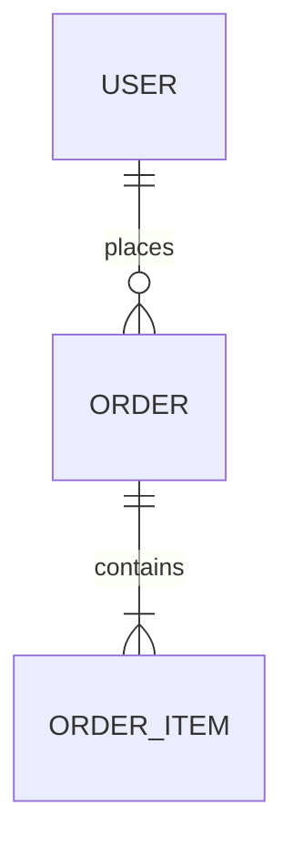

# 架构文档模板

## 文档信息
- **项目名称:** 
- **版本:** v1.0
- **作者:** Athena
- **日期:** YYYY-MM-DD

---

## 1. 概述

### 1.1 背景
[项目背景和目标]

### 1.2 目标
[架构设计的目标]

### 1.3 约束
[技术约束、业务约束、资源约束]

---

## 2. 系统架构

### 2.1 架构图

### 2.2 架构说明
[详细说明架构设计]

### 2.3 设计原则
- 原则1:
- 原则2:

---

## 3. 模块设计

### 3.1 模块划分

| 模块 | 职责 | 技术栈 |
|------|------|--------|
| | | |

### 3.2 模块详细

#### 模块A
- **职责:** 
- **接口:** 
- **依赖:** 

---

## 4. 数据设计

### 4.1 数据模型

### 4.2 数据流

[描述数据如何流动]

---

## 5. 接口设计

### 5.1 API 列表

| 方法 | 路径 | 描述 |
|------|------|------|
| GET | /api/v1/xxx | |

### 5.2 API 详情
[链接到详细 API 文档]

---

## 6. 技术选型

| 类别 | 选择 | 理由 |
|------|------|------|
| 框架 | | |
| 数据库 | | |
| 缓存 | | |

---

## 7. 非功能性设计

### 7.1 性能
- 目标:
- 策略:

### 7.2 可扩展性
- 水平扩展:
- 垂直扩展:

### 7.3 安全性
- 认证:
- 授权:
- 加密:

---

## 8. 部署架构

### 8.1 环境规划
| 环境 | 用途 | 配置 |
|------|------|------|
| dev | | |
| staging | | |
| prod | | |

### 8.2 容灾方案
[灾备和恢复策略]

---

## 附录

### ADR 索引
- [ADR-001](./adr/ADR-001.md)

### 相关文档
- [文档1]
- [文档2]