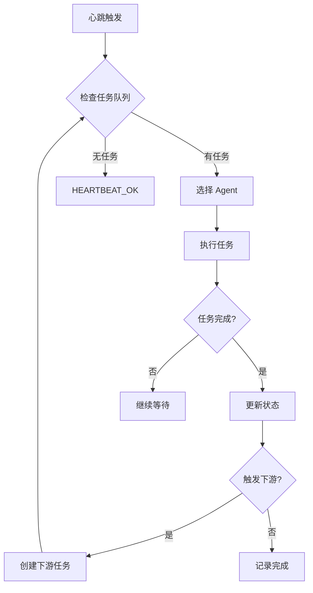

# AutoLoop - 自动迭代引擎

## 概述

AutoLoop 是团队的自动迭代引擎，负责：
1. **任务调度** - 分发任务给合适的 Agent
2. **心跳驱动** - 定期检查任务状态和触发工作
3. **协作编排** - 协调多个 Agent 之间的工作流转
4. **进度追踪** - 记录整体项目进度

---

## 工作模式

### 模式 1: Heartbeat 驱动 (推荐)

通过 HEARTBEAT.md 定期检查，触发迭代：

```
HEARTBEAT.md 定义检查项 → 每次心跳执行 → Agent 自动工作 → 更新状态
```

### 模式 2: Cron 定时任务

通过 cron 定时触发特定 Agent 工作：

```
Cron Job → 唤醒 Agent → 执行任务 → 报告结果
```

### 模式 3: 事件驱动

通过外部事件触发：

```
用户请求 / Git Hook / API 调用 → 触发 Agent → 处理事件
```

---

## 迭代流程



---

## 文件结构

```
/Users/kirito/Documents/projects/agents/
├── TEAM.md                    # 团队手册
├── autoloop/                  # 自动迭代引擎
│   ├── ENGINE.md              # 本文件
│   ├── tasks.json             # 任务队列
│   ├── status.json            # 项目状态
│   ├── heartbeat-check.md     # 心跳检查清单
│   └── logs/                  # 迭代日志
│       └── YYYY-MM-DD.md
├── orion-product/
├── athena-architect/
├── ...
```

---

## Agent 激活方式

### 方式 1: 直接对话激活

在对话中提及 Agent 名字：

```
"Orion, 分析这个需求..."
"Athena, 设计架构..."
"Phoenix, 实现组件..."
```

### 方式 2: 任务文件激活

创建任务文件，Agent 在心跳时自动发现：

```json
// tasks.json
{
  "pending": [
    {
      "id": "TASK-001",
      "type": "requirement-analysis",
      "assignee": "orion-product",
      "input": "docs/input/需求描述.md",
      "output": "docs/prd/",
      "priority": "P0",
      "created": "2026-04-06T02:00:00Z",
      "triggerNext": ["athena-architect"]
    }
  ]
}
```

### 方式 3: Spawn 子会话

通过 sessions_spawn 创建独立的 Agent session：

```javascript
// 代码中调用
sessions_spawn({
  runtime: "acp",
  agentId: "orion-product",
  task: "分析需求并生成 PRD",
  cwd: "/Users/kirito/Documents/projects/agents"
})
```

---

## 心跳检查配置

在主 workspace 的 HEARTBEAT.md 中添加：

```markdown
# HEARTBEAT.md

## 团队任务检查

检查 `/Users/kirito/Documents/projects/agents/autoloop/tasks.json`:
- 如果有 pending 任务，分配给对应 Agent
- 如果有 blocked 任务，检查阻塞是否解除
- 如果有完成的任务，触发下游 Agent

## Agent 健康检查

检查各 Agent 的 `memory/YYYY-MM-DD.md`:
- 确认每个 Agent 都有当日日志
- 如果某 Agent 超过 24h 无更新，发送提醒

## 项目进度同步

检查 `autoloop/status.json`:
- 更新项目整体进度
- 识别风险和阻塞点
```

---

## 任务流转规则

| 任务类型 | 执行者 | 完成后触发 |
|----------|--------|-----------|
| requirement-analysis | Orion | Athena (架构评估) |
| architecture-design | Athena | Phoenix + Atlas (开发) |
| frontend-implementation | Phoenix | Oracle (前端测试) |
| backend-implementation | Atlas | Oracle (后端测试) |
| testing | Oracle | Nova (部署准备) |
| deployment | Nova | Scribe (文档更新) |
| documentation | Scribe | 无 |

---

## 状态文件

```json
// status.json
{
  "project": {
    "name": "项目名称",
    "phase": "requirement",  // requirement/design/develop/test/deploy
    "started": "2026-04-06",
    "lastUpdate": "2026-04-06T02:00:00Z"
  },
  "agents": {
    "orion-product": {
      "status": "idle",
      "lastActive": "2026-04-06T01:00:00Z",
      "tasksCompleted": 0
    },
    "athena-architect": {
      "status": "idle",
      "lastActive": null,
      "tasksCompleted": 0
    }
  },
  "metrics": {
    "tasksTotal": 0,
    "tasksCompleted": 0,
    "tasksPending": 0,
    "tasksBlocked": 0
  }
}
```

---

## 使用示例

### 1. 启动新迭代周期

```bash
# 创建初始任务
# 编辑 autoloop/tasks.json，添加第一个任务

# 触发心跳（或等待自动心跳）
# Agent 会自动发现任务并开始工作
```

### 2. 手动触发特定 Agent

```
对话中:
"Orion, 请分析以下需求: [需求描述]"
```

### 3. 查看进度

```
对话中:
"查看项目进度"
"检查任务队列"
```

---

## 进阶: 自动化程度

### Level 1: 手动触发 (当前)
- 用户在对话中激活 Agent
- Agent 执行并返回结果
- 用户手动触发下一个 Agent

### Level 2: 任务队列驱动
- 用户创建任务文件
- 心跳自动分发任务
- Agent 执行并自动触发下游

### Level 3: 完全自动化
- Git Hook 自动触发分析
- 全流程自动流转
- 只在关键节点需要人工确认

---

*此引擎需要配合主 workspace 的心跳系统使用*